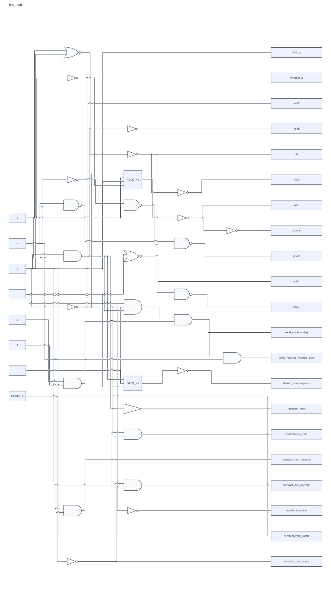

# Toy example results

## Circuit outline

AI-generated toy circuit covering basic gates, XOR/XNOR, MUX, AOI/OAI, wide AND functions, shared paths, constants, and inversion.

| Property | Original circuit |
| --- | ---: |
| Inputs | 7 |
| Outputs | 21 |
| Nodes | 76 |
| Edges | 90 |
| Logic cells (AND/INV) | 47 |

[Input DAG](../input/toy.json) · [Balanced mapped DAG](../output/experiments/toy_balanced.json)

## Result table (balanced)

Weights `(wA, wP, wD) = (0.34, 0.33, 0.33)`.

| Metric | Original | Balanced | Change |
| --- | ---: | ---: | ---: |
| Cells | 47 | 28 | -40.43% |
| Area (μm²) | 36.708 | 22.610 | -38.41% |
| Representative leakage power (nW) | 910.283 | 548.471 | -39.75% |
| Delay (ns) | 0.204149 | 0.173827 | -14.85% |

## Cell utilization table

| Library cell | Input | Opt (balanced) |
| --- | ---: | ---: |
| INV_X1 | 25 | 11 |
| AND2_X1 | 22 | 7 |
| NAND2_X1 | - | 4 |
| NOR2_X1 | - | 2 |
| AND3_X1 | - | 1 |
| AOI22_X1 | - | 1 |
| BUF_X1 | - | 1 |
| OAI21_X1 | - | 1 |
| **Total** | **47** | **28** |

## Comparison by weight setting

| Metric | Original | Area priority | Leakage priority | Delay priority | Balanced |
| --- | ---: | ---: | ---: | ---: | ---: |
| Weights (A, P, D) | — | 0.8, 0.1, 0.1 | 0.1, 0.8, 0.1 | 0.1, 0.1, 0.8 | 0.34, 0.33, 0.33 |
| Cells | 47 | 27 (-42.55%) | 28 (-40.43%) | 30 (-36.17%) | 28 (-40.43%) |
| Area (μm²) | 36.708 | 22.078 (-39.86%) | 22.610 (-38.41%) | 26.866 (-26.81%) | 22.610 (-38.41%) |
| Representative leakage power (nW) | 910.283 | 543.256 (-40.32%) | 538.247 (-40.87%) | 836.536 (-8.10%) | 548.471 (-39.75%) |
| Delay (ns) | 0.204149 | 0.173827 (-14.85%) | 0.173827 (-14.85%) | 0.168021 (-17.70%) | 0.173827 (-14.85%) |

## Balanced circuit plot

[Open full-size SVG](../output/plots/toy_balanced.svg)
